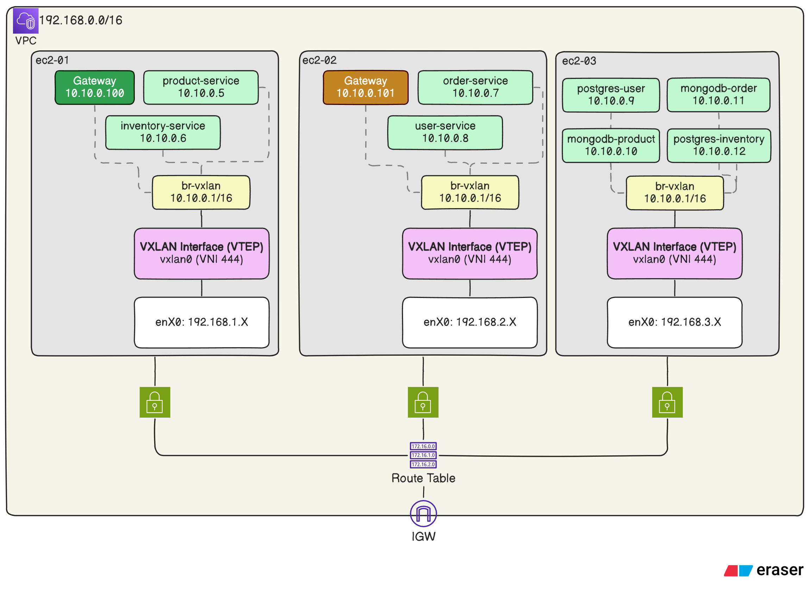

#### Project Overview

The goal of this project is to,

1. Provision 3 EC2 instance with separate subnets inside a custom VPC.
2. Configure 3 EC2 instance with VxLAN so that containers running inside these EC2 can communicate with each other with VxLAN overlay.
3. Deploy E-commerce microservice containers across the EC2 instances.

The total deployment is automated through Pulumi (Python), Bash and Makefile.

#### Architecture

LLD of the infrastructure:



In this architecture, 3 microservice running on first EC2, 3 microservices running on second EC2 and 4 microservices are running on third EC2.

API GW is in Active-Active state in first and second EC2. All the database, with its storage volume is in the third EC2.

All microservices are communicating with each other using docker bridge network IP. This is being possible through VXLAN interface.

#### Prerequisites

Before running the project, ensure you have:

- **AWS Account** with proper permissions and balance.
- **Pulumi CLI** installed.
- **AWS CLI** installed and configured with access and secret token.
- **Postman** installed.

#### Deployment & Execution

> **Attention**: Make sure you have all the prerequisites mentioned previously before proceeding for deployment.

To deploy the infrastructure and services you just need to run 2 commands.

1. **Use The Template**. Yes, this repo is actually a Pulumi template. You can directly setup you project just running the following command in an **empty directory**.

   ```
   pulumi new https://github.com/kcnaiamh/distributed-microservices-using-vxlan-pulumi-bash-aws
   ```

2. **Run Pulumi Up**. This command will provision the AWS resources as defined in `__main__.py`.

   ```
   pulumi up --yes
   ```

   It will take 3/4 minute for provisioning the AWS infrastructure.

   If you want to get into the first EC2, just run `ssh host1` in your terminal. Similarly, `ssh host2` and `ssh host3` respectively.

3. **Import Postman**. Import `e-commerce apis.postman_collection.json` file into postman to interact with the e-commerce site.

   Make sure you update `TARGET_HOST` variable with one of the gateway IPs.

4. **Do the Cleanup**. Run `pulumi destroy --yes --remove` to delete the whole infrastructure. (Be cautious about AWS bill.)

#### Challenges and Solutions

During doing the project, I encountered several challenges. In this section, I'll highlight the most significant ones and how I resolved them.

1. Implementing with 3 different VNIs — Disaster
2. Using VRRP protocol with keepalived for single GW IP
3. Multiple docker-compose file, but same network
   1. separate bridge
   2. pre declared ip
   3. /etc/hosts
4. SSH keypair changes every time I do `pulumi up -y`
   1. Multi cast not supported.
   2. Used Route53 Fallback for testing

---

#### Setup Without Pulumi Template

If you want to clone the git repo and want to configure it manually then following this instruction:

1. Clone the git repo.
   ```
   git clone git@github.com:kcnaiamh/distributed-microservices-using-vxlan-pulumi-bash-aws.git
   ```
2. Remove `.example` from `Pulumi.dev.yaml.example` file name.
3. Setup python virtual environment. (assuming linux environment)
   ```
   python3 -m venv venv
   source ./venv/bin/activate
   pip install -r requirements.txt
   ```
4. Provide AWS configuration and credential.
   ```
   aws configure
   ```
5. Create a stack name `dev` (assuming `dev` stack not exist yet)
   ```
   pulumi stack init dev
   ```
6. Dry run the code
   ```
   pulumi preview
   ```
7. Deploy it
   ```
   pulumi up -y
   ```
